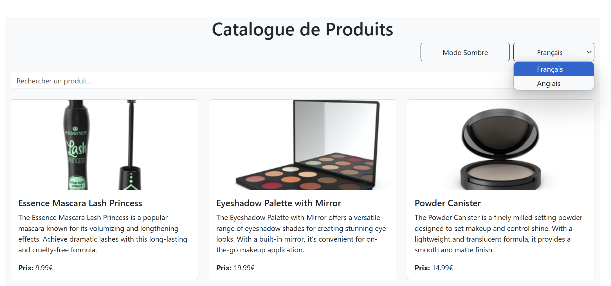
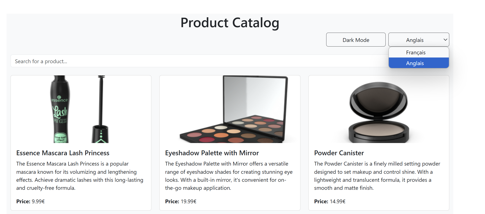

# TP React Hooks - Application de Gestion de Produits

Ce TP a pour objectif de mettre en pratique l'utilisation des Hooks React (useState, useEffect, useContext) ainsi que la création de Hooks personnalisés.

## Installation et configuration initiale

1. Cloner le dépôt :

```bash
git clone https://github.com/pr-daaif/tp-react-hooks.git
cd tp-react-hooks
```

2. Créer votre propre dépôt sur Github et changer le remote :

```bash
# Supprimer le remote origine
git remote remove origin

# Ajouter votre nouveau remote
git remote add origin https://github.com/[votre-username]/tp-react-hooks.git

# Premier push
git push -u origin main
```

3. Installer les dépendances :

```bash
npm install
```

4. Lancer l'application :

```bash
npm start
```

## Instructions pour le TP

Pour chaque exercice :

1. Lisez attentivement l'énoncé
2. Implémentez la solution
3. Testez votre implémentation (pensez à faire des copies d'écran)
4. Mettez à jour la section correspondante dans ce README avec :
   - Une brève explication de votre solution
   - Des captures d'écran montrant le fonctionnement
   - Les difficultés rencontrées et comment vous les avez résolues
5. Commitez vos changements avec un message descriptif

### Exercice 1 : État et Effets

#### Objectif : Implémenter une recherche en temps réel

- [ ] 1.1 Modifier le composant ProductSearch pour utiliser la recherche
- [ ] 1.2 Implémenter le debounce sur la recherche
- [ ] 1.3 Documenter votre solution ici

_Réponse pour l'exercice 1 :_

J’ai déplacé l’état de l’input vers le composant parent afin de le partager plus facilement avec ProductList via les props. Ensuite, j’ai transmis searchTerm à ProductList, où il est utilisé pour filtrer les produits renvoyés par le hook useProductSearch. Ainsi, seuls les produits correspondant à la recherche de l’utilisateur sont affichés.

Pour optimiser les performances et éviter les rendus inutiles lors de saisies rapides, j’ai implémenté un hook personnalisé de debounce. Intégré dans ProductSearch, il introduit un léger délai avant l’exécution, réduisant ainsi les re-renders et améliorant la fluidité de l’application.


### Exercice 2 : Context et Internationalisation

#### Objectif : Gérer les préférences de langue

- [ ] 2.1 Créer le LanguageContext
- [ ] 2.2 Ajouter le sélecteur de langue
- [ ] 2.3 Documenter votre solution ici

_Réponse pour l'exercice 2 :_

J’ai mis en place le LanguageContext pour centraliser la gestion des préférences linguistiques de l’application. Grâce à ce contexte, la langue sélectionnée peut être partagée entre les différents composants sans nécessiter de passage manuel des props à chaque niveau.

J’ai également intégré un sélecteur de langue dans le composant LanguageSelector, permettant aux utilisateurs de modifier la langue de l’interface. Lorsqu’une nouvelle langue est choisie, l’état est mis à jour dans le LanguageContext, ce qui déclenche automatiquement la mise à jour des composants qui l’utilisent.




### Exercice 3 : Hooks Personnalisés

#### Objectif : Créer des hooks réutilisables

- [ ] 3.1 Créer le hook useDebounce
- [ ] 3.2 Créer le hook useLocalStorage
- [ ] 3.3 Documenter votre solution ici

_Réponse pour l'exercice 3 :_

J’ai développé deux hooks personnalisés : useDebounce et useLocalStorage.

useDebounce permet de différer la mise à jour d’une valeur jusqu’à l’expiration d’un délai défini, évitant ainsi les mises à jour trop fréquentes.
useLocalStorage assure la gestion et la synchronisation d’un état avec le localStorage du navigateur, garantissant la persistance des données.

### Exercice 4 : Gestion Asynchrone et Pagination

#### Objectif : Gérer le chargement et la pagination

- [ ] 4.1 Ajouter le bouton de rechargement
- [ ] 4.2 Implémenter la pagination
- [ ] 4.3 Documenter votre solution ici

_Votre réponse pour l'exercice 4 :_

```
Expliquez votre solution ici
[Ajoutez vos captures d'écran]
```

## Rendu

- Ajoutez l'URL de votre dépôt Github dans **Classroom** et envoyer la réponse dès le démarage de votre projet.
- Les push doivent se faire au fûr et à mesure que vous avancez dans votre projet.
- Le README.md doit être à jour avec vos réponses et captures d'écran.
- Chaques exercice doit faire l'objet d'au moins un commit avec un message mentionnant le numéro de l'exercice.
